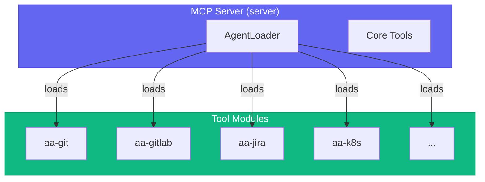

# 🔧 Tool Modules Reference

Tool modules are MCP plugins that provide specific capabilities. Each module contains related tools that are loaded based on which persona is active.

> **Terminology:** "Personas" (sometimes called "agents") are tool configuration profiles that determine which modules are loaded. This is NOT a multi-agent AI system.

## Quick Reference

| Module | Tools | Description |
|--------|-------|-------------|
| [workflow](./workflow.md) | 30 | Core server, agents, skills, memory, vpn_connect, kube_login |
| [git](./git.md) | 19 | Git operations |
| [gitlab](./gitlab.md) | 35 | MRs, pipelines, code review |
| [jira](./jira.md) | 28 | Issue tracking (including set_summary, set_priority, set_epic) |
| [k8s](./k8s.md) | 26 | Kubernetes operations |
| [bonfire](./bonfire.md) | 21 | Ephemeral namespaces |
| [quay](./quay.md) | 8 | Container registry |
| [prometheus](./prometheus.md) | 13 | Metrics queries |
| [alertmanager](./alertmanager.md) | 7 | Alert management |
| [kibana](./kibana.md) | 9 | Log search |
| [google-calendar](./google-calendar.md) | 6 | Calendar & meetings |
| [gmail](./gmail.md) | 6 | Email processing |
| [slack](./slack.md) | 16 | Slack integration (+slack_dm_gitlab_user) |
| [konflux](./konflux.md) | 40 | Build pipelines |
| [appinterface](./appinterface.md) | 8 | GitOps config (+appinterface_get_user) |

**Total:** ~260+ tools across 16 modules

> Plus **45 shared parsers** in `scripts/common/parsers.py` for reusable output parsing (including `extract_web_url`, `extract_mr_url`)

## Architecture



## Module Categories

### 💻 Development

| Module | Purpose |
|--------|---------|
| [git](./git.md) | Git repository operations |
| [gitlab](./gitlab.md) | GitLab MRs, pipelines, comments |
| [jira](./jira.md) | Jira issue management |

### ☸️ Infrastructure

| Module | Purpose |
|--------|---------|
| [k8s](./k8s.md) | Kubernetes pods, deployments, logs |
| [bonfire](./bonfire.md) | Ephemeral namespace management |
| [quay](./quay.md) | Container image verification |

### 📊 Monitoring

| Module | Purpose |
|--------|---------|
| [prometheus](./prometheus.md) | Metrics and alert queries |
| [alertmanager](./alertmanager.md) | Alert and silence management |
| [kibana](./kibana.md) | Log search and analysis |

### 💬 Communication

| Module | Purpose |
|--------|---------|
| [slack](./slack.md) | Slack message handling |
| [google-calendar](./google-calendar.md) | Calendar and meetings |
| [gmail](./gmail.md) | Email processing and summarization |

### 📦 Release

| Module | Purpose |
|--------|---------|
| [konflux](./konflux.md) | Build pipelines |
| [appinterface](./appinterface.md) | GitOps configuration |

### 🔧 Core/Workflow

| Module | Purpose |
|--------|---------|
| [workflow](./workflow.md) | Agents, skills, memory, infrastructure tools |

## Infrastructure Tools

The workflow module includes essential infrastructure tools for auto-healing:

| Tool | Purpose |
|------|---------|
| `vpn_connect()` | Connect to Red Hat VPN for internal resources |
| `kube_login(cluster)` | Refresh Kubernetes authentication |
| `session_start(agent)` | Initialize session with context |
| `debug_tool(tool, error)` | Analyze failing tool source code |

These are used by skill auto-healing to recover from common failures.

## Module Loading

Modules are loaded dynamically when you switch agents:

```
You: Load devops agent

Claude: [AgentLoader]
        → Unloading: git, gitlab, jira, google-calendar
        → Loading: k8s, bonfire, quay, gitlab
        → Notifying Cursor of tool change

        🔧 DevOps agent ready with 90 tools
```

## Environment Variables

| Variable | Module | Description |
|----------|--------|-------------|
| `JIRA_URL` | jira | Jira instance URL |
| `JIRA_JPAT` | jira | Jira Personal Access Token |
| `GITLAB_TOKEN` | gitlab | GitLab API token |
| `KUBECONFIG` | k8s | Default kubeconfig path |

> **Note:** Quay uses `skopeo` which leverages your existing `docker login` credentials - no separate token needed!

## Adding a New Module

1. Create directory: `tool_modules/aa-{name}/src/`

2. Create `tools.py`:
```python
from mcp.server.fastmcp import FastMCP

def register_tools(server: FastMCP) -> int:
    @server.tool()
    async def my_tool(arg: str) -> str:
        """Tool description."""
        return f"Result: {arg}"

    return 1  # tool count
```

3. Add to `server/persona_loader.py`:
```python
TOOL_MODULES = {
    "{name}": 5,  # estimated tool count
}
```

4. Add to persona config:
```yaml
tools:
  - {name}
```

5. Add to `tool_modules/aa-workflow/src/meta_tools.py`:
```python
TOOL_REGISTRY = {
    # ...
    "{name}": ["my_tool", ...],
}

MODULE_PREFIXES = {
    # ...
    "my_": "{name}",
}
```

## See Also

- [Architecture Overview](../architecture/README.md)
- [Personas](../personas/README.md)
- [MCP Implementation Details](../architecture/mcp-implementation.md)
- [Skills Reference](../skills/README.md) - Skills that use these tools
