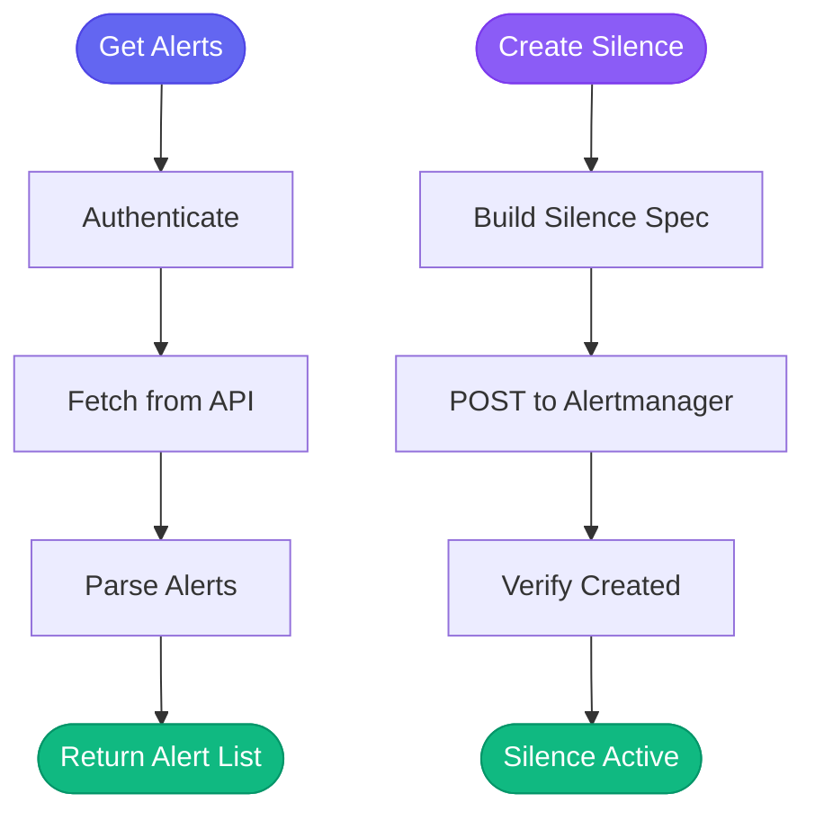

# 🚨 alertmanager

> Alert and silence management

## Overview

The `aa_alertmanager` module provides tools for managing Alertmanager alerts, silences, and receivers.

## Tool Count

**7 tools**

## Tools

| Tool | Description |
|------|-------------|
| `alertmanager_alerts` | List alerts with filtering |
| `alertmanager_get_silences` | List active silences |
| `alertmanager_create_silence` | Create a silence |
| `alertmanager_delete_silence` | Delete a silence |
| `alertmanager_get_receivers` | List alert receivers |
| `alertmanager_check_health` | Health check |
| `alertmanager_get_status` | Get status |

## Usage Examples

### List Alerts

```python
alertmanager_alerts(
    environment="production",
    filter_name="AutomationAnalytics",  # Only AA alerts
    silenced=False,  # Exclude silenced
    active=True
)
```

### Create Silence

```python
alertmanager_create_silence(
    environment="production",
    matchers=[{"name": "alertname", "value": "HighMemoryUsage"}],
    duration="2h",
    comment="Investigating memory issue",
    created_by="daoneill"
)
```

### Delete Silence

```python
alertmanager_delete_silence(
    environment="production",
    silence_id="abc123..."
)
```

## Configuration

URLs and kubeconfig paths are defined in `config.json`:

```json
{
  "alertmanager": {
    "environments": {
      "stage": {
        "url": "https://alertmanager.crcs02ue1.devshift.net",
        "kubeconfig": "/home/user/.kube/config.s"
      },
      "production": {
        "url": "https://alertmanager.crcp01ue1.devshift.net",
        "kubeconfig": "/home/user/.kube/config.p"
      }
    }
  }
}
```

## Alert Management Flow



## Loaded By

- [🚨 Incident Persona](../personas/incident.md)

## Related Skills

- [investigate_alert](../skills/investigate_alert.md) - Quick triage
- [coffee](../skills/coffee.md) - Morning alert check
