# 🔗 appinterface

> GitOps configuration management

## Overview

The `aa_appinterface` module provides tools for managing app-interface (GitOps) configuration.

## Tool Count

**7 tools**

## Tools

| Tool | Description |
|------|-------------|
| `appinterface_get_config` | Get current config |
| `appinterface_get_ref` | Get deployed ref |
| `appinterface_update_ref` | Update image ref |
| `appinterface_get_namespace` | Get namespace config |
| `appinterface_get_alerts` | Get alert definitions |
| `appinterface_validate` | Validate changes |

## Key Paths

```
app-interface/
├── data/services/insights/tower-analytics/
│   ├── cicd/
│   │   └── deploy-clowder.yml      # Deployment config
│   └── namespaces/
│       ├── tower-analytics-prod.yml
│       ├── tower-analytics-stage.yml
│       └── tower-analytics-prod-billing.yml
└── resources/
    ├── insights-prod/              # Production alerts
    └── insights-stage/             # Stage alerts
```

## Usage Examples

### Get Current Deployed SHA

```python
appinterface_get_ref(
    namespace="tower-analytics-prod",
    component="tower-analytics-clowdapp"
)
```

### Get Alert Definitions

```python
appinterface_get_alerts(namespace="tower-analytics-prod")
```

## Process Flow

```mermaid
flowchart LR
    START([Query Request]) --> GET[Get Config/Ref]
    GET --> PARSE[Parse YAML]
    PARSE --> VALIDATE{Valid?}
    VALIDATE -->|Yes| RETURN[Return Data]
    VALIDATE -->|No| ERROR[❌ Error]

    UPDATE([Update Request]) --> MODIFY[Modify YAML]
    MODIFY --> COMMIT[Commit to Repo]
    COMMIT --> MR[Create MR]

    style START fill:#6366f1,stroke:#4f46e5,color:#fff
    style RETURN fill:#10b981,stroke:#059669,color:#fff
    style ERROR fill:#ef4444,stroke:#dc2626,color:#fff
```



## Loaded By

- [📦 Release Persona](../personas/release.md)

## Related Skills

- [release_aa_backend_prod](../skills/release_aa_backend_prod.md) - Updates refs
- [debug_prod](../skills/debug_prod.md) - Checks deployed version
