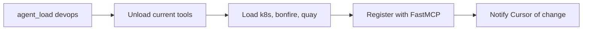

# 🧠 common (aa-common)

> Core MCP server with agent loading, workflow tools, and shared utilities

## Overview

The `aa-common` module is the **central hub** of the AI Workflow system. It provides:

- Dynamic agent loading and switching
- Core workflow tools (skills, memory, debugging)
- Shared utilities for all other MCP servers
- The main MCP server entry point

## Tool Count

**28 core tools** (plus dynamically loaded tools from other modules)

## Tools

### Agent Management

| Tool | Description |
|------|-------------|
| `session_start` | Initialize session and load agent |
| `agent_load` | Switch to a different agent |
| `agent_list` | List available agents |
| `agent_current` | Get current agent info |

### Skills

| Tool | Description |
|------|-------------|
| `skill_list` | List available skills |
| `skill_run` | Execute a skill with inputs |
| `skill_view` | View skill definition |

### Memory

| Tool | Description |
|------|-------------|
| `memory_read` | Read from persistent memory |
| `memory_write` | Write to persistent memory |
| `memory_append` | Append to memory section |
| `memory_list` | List memory contents |
| `memory_session_log` | Log session activity |

### Debugging

| Tool | Description |
|------|-------------|
| `debug_tool` | Get tool source for debugging |
| `debug_fix` | Apply fix to a tool |

### Configuration

| Tool | Description |
|------|-------------|
| `config_get` | Get configuration value |
| `config_list_repos` | List configured repositories |

## Shared Utilities

Located in `aa-common/src/utils.py`:

| Function | Description |
|----------|-------------|
| `load_config()` | Load config.json with caching |
| `get_kubeconfig(env)` | Get kubeconfig for environment |
| `run_cmd()` | Execute shell commands |
| `get_token_from_kubeconfig()` | Extract bearer tokens |
| `resolve_repo_path()` | Resolve repository paths |
| `get_section_config()` | Get config section |

## Shared Parsers

Located in `scripts/common/parsers.py` - **42 reusable parser functions**:

| Category | Count | Examples |
|----------|-------|----------|
| MR Parsing | 10 | `parse_mr_list`, `extract_mr_id_from_url` |
| Jira | 6 | `extract_jira_key`, `validate_jira_key` |
| Git | 9 | `parse_git_log`, `extract_conflict_files` |
| Kubernetes | 2 | `parse_kubectl_pods`, `parse_namespaces` |
| Alerts | 4 | `parse_prometheus_alert`, `parse_error_logs` |
| Deploy | 6 | `parse_deploy_clowder_ref`, `get_next_version` |
| Utility | 5 | `slugify_text`, `extract_json_from_output` |

## Dynamic Tool Loading

When you switch agents, `aa-common` dynamically loads/unloads tool modules:



## Usage

```bash
# Run as developer agent (default)
make mcp-developer

# Run as devops agent
make mcp-devops

# Run with custom tools
make mcp-custom TOOLS="git,jira,slack"
```

## Configuration

Configure in `config.json`:

```json
{
  "agent": {
    "provider": "vertex",
    "model": "claude-sonnet-4-20250514",
    "max_tokens": 4096
  }
}
```

## Related

- [Architecture Overview](../architecture/README.md)
- [Agents Reference](../agents/README.md)
- [Skills Reference](../skills/README.md)
