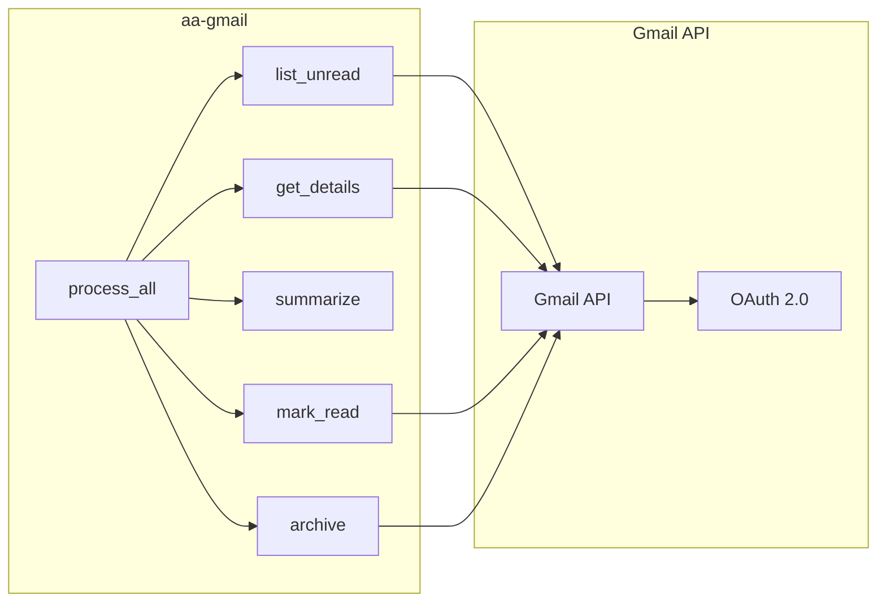

# Gmail MCP Server (aa-gmail)

Email processing and management using the Gmail API.

## Overview

The Gmail MCP server provides tools for reading, summarizing, and organizing emails. It integrates with Google's Gmail API using OAuth 2.0 authentication.

## Tools (~6)

| Tool | Description |
|------|-------------|
| `gmail_list_unread_messages` | List unread emails in inbox |
| `gmail_get_message_details` | Get full email content |
| `gmail_summarize_message` | AI-powered email summary |
| `gmail_mark_as_read` | Mark email as read |
| `gmail_archive_message` | Archive an email |
| `gmail_process_unread_emails` | Batch process: read, summarize, archive |

## Configuration

Configured in `config.json`:

```json
{
  "google_gmail": {
    "enabled": true,
    "token_path": "~/.google_tokens/gmail_token.json",
    "credentials_path": "~/.google_tokens/credentials.json",
    "scopes": [
      "https://www.googleapis.com/auth/gmail.readonly",
      "https://www.googleapis.com/auth/gmail.modify"
    ]
  }
}
```

## Authentication

Uses OAuth 2.0 with the same credentials as Google Calendar. Run `/google-reauth` to set up.

### Required Scopes

- `gmail.readonly` - Read email messages
- `gmail.modify` - Mark as read, archive

## Examples

### Process Morning Emails

```python
# Get unread emails
gmail_list_unread_messages()

# Process all unread (summarize, mark read, archive)
gmail_process_unread_emails()
```

### Read Specific Email

```python
# Get email details
gmail_get_message_details(message_id="abc123")

# Summarize it
gmail_summarize_message(message_id="abc123")
```

## Architecture



## Used By

- [☕ coffee](../skills/coffee.md) - Morning email summary
- Developer agent - Email management

## Related

- [Google Calendar](google-calendar.md) - Shares OAuth credentials
- [Workflow](workflow.md) - Core workflow tools
