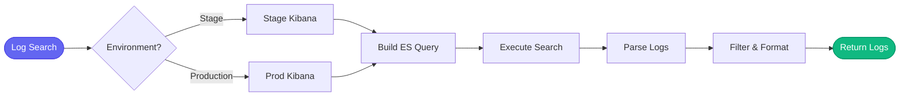

# 📜 kibana

> Log search and analysis

## Overview

The `aa_kibana` module provides tools for searching and analyzing logs in Kibana/Elasticsearch.

## Tool Count

**9 tools**

## Tools

| Tool | Description |
|------|-------------|
| `kibana_search` | Search logs with query |
| `kibana_get_errors` | Get recent errors |
| `kibana_get_logs` | Get logs for pod/service |
| `kibana_count` | Count matching logs |
| `kibana_aggregation` | Run aggregation query |
| `kibana_get_fields` | Get available fields |
| `kibana_check_health` | Health check |
| `kibana_get_indices` | List indices |
| `kibana_tail` | Tail logs in real-time |

## Usage Examples

### Search Logs

```python
kibana_search(
    environment="production",
    query="level:ERROR AND kubernetes.namespace_name:tower-analytics-prod",
    time_range="15m",
    limit=100
)
```

### Get Errors

```python
kibana_get_errors(
    environment="stage",
    namespace="tower-analytics-stage",
    time_range="1h"
)
```

### Count Occurrences

```python
kibana_count(
    environment="production",
    query="message:*OutOfMemory*",
    time_range="24h"
)
```

## Search Flow



## Loaded By

- [🚨 Incident Persona](../personas/incident.md)

## Related Skills

- [investigate_alert](../skills/investigate_alert.md) - Searches for errors
- [debug_prod](../skills/debug_prod.md) - Deep log analysis
