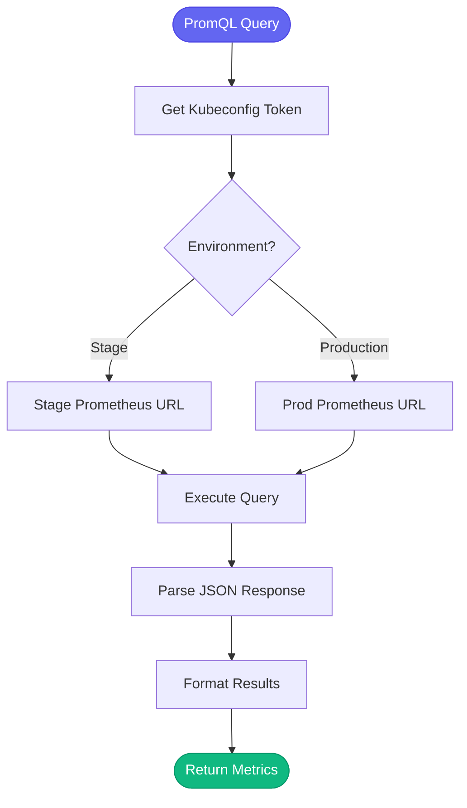

# 📊 prometheus

> Metrics and alert queries

## Overview

The `aa_prometheus` module provides tools for querying Prometheus metrics and checking alert status.

## Tool Count

**13 tools**

## Tools

| Tool | Description |
|------|-------------|
| `prometheus_query` | Execute PromQL query |
| `prometheus_query_range` | Time-range query |
| `prometheus_get_alerts` | List firing alerts |
| `prometheus_get_rules` | List alert rules |
| `prometheus_check_health` | API health check |
| `prometheus_get_targets` | List scrape targets |
| `prometheus_get_labels` | Get label values |
| `prometheus_get_metadata` | Get metric metadata |
| `prometheus_check_alert_rule` | Check specific rule |

## Usage Examples

### Execute Query

```python
prometheus_query(
    environment="production",
    query="sum(rate(http_requests_total[5m]))"
)
```

### Query Range

```python
prometheus_query_range(
    environment="stage",
    query="container_memory_usage_bytes{namespace='tower-analytics-stage'}",
    start="-1h",
    end="now",
    step="5m"
)
```

### Get Firing Alerts

```python
prometheus_get_alerts(environment="production")
```

## Authentication

Uses kubeconfig for authentication:

| Environment | Kubeconfig |
|-------------|------------|
| Stage | `~/.kube/config.s` |
| Production | `~/.kube/config.p` |

## Query Flow



## Loaded By

- [🚨 Incident Persona](../personas/incident.md)

## Related Skills

- [investigate_alert](../skills/investigate_alert.md) - Queries metrics
- [debug_prod](../skills/debug_prod.md) - Deep analysis
