# 📦 quay

> Container registry operations

## Overview

The `aa_quay` module provides tools for checking container images in Quay.io registries using `skopeo`.

## Tool Count

**8 tools**

## Tools

| Tool | Description |
|------|-------------|
| `quay_get_tag` | Get tag details and digest |
| `quay_list_tags` | List available tags |
| `quay_get_manifest` | Get image manifest |
| `quay_image_exists` | Check if image exists |
| `quay_get_digest` | Get SHA256 digest |
| `quay_inspect` | Inspect image metadata |
| `quay_list_repos` | List repositories |
| `quay_get_labels` | Get image labels |

## Authentication

> **No token required!** Uses `skopeo` which leverages your existing `podman login` or `docker login` credentials.

Pre-authenticate:
```bash
podman login quay.io
# or
docker login quay.io
```

## Usage Examples

### Check Image Exists

```python
quay_get_tag(
    repository="redhat-user-workloads/aap-aa-tenant/aap-aa-main/automation-analytics-backend-main",
    tag="abc123def456789..."  # Full 40-char SHA
)
```

### Get Digest

```python
quay_get_digest(
    repository="redhat-user-workloads/aap-aa-tenant/aap-aa-main/automation-analytics-backend-main",
    tag="abc123def456789..."
)
# Returns: sha256:20a4c9760040bf9e8446b921f1415c7e...
```

### List Tags

```python
quay_list_tags(
    repository="redhat-user-workloads/aap-aa-tenant/aap-aa-main/automation-analytics-backend-main",
    limit=20
)
```

## Image Tag Formats

| Type | Format | Length |
|------|--------|--------|
| Git SHA | `abc123def456...` | 40 chars |
| SHA256 Digest | `sha256:20a4c976...` | 71 chars |
| Short SHA | `abc123` | ❌ NOT SUPPORTED |

## Image Verification Flow

```mermaid
flowchart LR
    START([Check Image]) --> SKOPEO[skopeo inspect]
    SKOPEO --> FOUND{Image Exists?}
    FOUND -->|Yes| DIGEST[Get SHA256 Digest]
    FOUND -->|No| ERROR[❌ Manifest Unknown]

    DIGEST --> VULN{Check Vulns?}
    VULN -->|Yes| SCAN[Get Vulnerability Report]
    VULN -->|No| RETURN

    SCAN --> PARSE[Parse CVEs]
    PARSE --> RETURN([Return Status])

    style START fill:#6366f1,stroke:#4f46e5,color:#fff
    style RETURN fill:#10b981,stroke:#059669,color:#fff
    style ERROR fill:#ef4444,stroke:#dc2626,color:#fff
```



## Loaded By

- [🔧 DevOps Persona](../personas/devops.md)
- [📦 Release Persona](../personas/release.md)

## Related Skills

- [test_mr_ephemeral](../skills/test_mr_ephemeral.md) - Verifies images before deploy
- [release_aa_backend_prod](../skills/release_aa_backend_prod.md) - Checks release images
