# Modular MCP Server Architecture

## Design Principles

1. **Single MCP Server**: One server loads/unloads tools dynamically based on active agent
2. **Dynamic Agent Loading**: Switch agents mid-session with tools updating automatically
3. **Tool Modules**: Each domain has tools in a `tools.py` with `register_tools(server)` function
4. **Auto-Debug**: All tools wrapped with `@debuggable` for self-healing capabilities
5. **Dual Mode**: Each module can run standalone OR be loaded as a plugin

## Directory Structure

```
mcp-servers/
├── aa-common/                    # Shared infrastructure
│   ├── src/
│   │   ├── __init__.py
│   │   ├── server.py             # Main server with tool loading
│   │   ├── config.py             # Shared configuration
│   │   └── web.py                # Web UI (optional)
│   └── pyproject.toml
│
├── aa-git/                       # Example tool module
│   ├── src/
│   │   ├── __init__.py           # Exports register_tools
│   │   ├── tools.py              # Tool definitions with register_tools(server)
│   │   └── server.py             # Thin standalone wrapper
│   └── pyproject.toml
│
└── aa-{other}/                   # Same pattern for all modules
```

## Tool Module Pattern

### tools.py - The Tool Definitions

```python
"""Git tool definitions."""

from mcp.server.fastmcp import FastMCP

def register_tools(server: FastMCP) -> int:
    """Register tools with the server.
    
    Args:
        server: FastMCP server instance
    
    Returns:
        Number of tools registered
    """
    
    @server.tool()
    async def git_status(repo: str) -> str:
        """Get git status."""
        # Implementation
        return "..."
    
    @server.tool()
    async def git_log(repo: str, limit: int = 10) -> str:
        """Get git log."""
        # Implementation  
        return "..."
    
    return 2  # Number of tools
```

### server.py - Standalone Wrapper

```python
"""Standalone entry point for aa-git."""

import asyncio
from mcp.server.fastmcp import FastMCP
from .tools import register_tools

def main():
    server = FastMCP("aa-git")
    register_tools(server)
    asyncio.run(server.run_stdio_async())

if __name__ == "__main__":
    main()
```

### __init__.py - Export

```python
from .tools import register_tools
__all__ = ["register_tools"]
```

## Usage Patterns

### 1. Dynamic Mode (Recommended)

Start with minimal tools, switch agents dynamically:

```bash
python -m src.server  # Starts with workflow tools only (~29)
```

Cursor config (in your project's `.cursor/mcp.json`):
```json
{
  "mcpServers": {
    "aa-workflow": {
      "command": "bash",
      "args": ["-c", "cd ~/src/ai-workflow/mcp-servers/aa-common && source ~/bonfire_venv/bin/activate && python3 -m src.server"]
    }
  }
}
```

Then in chat:
```
You: Load the devops agent
Claude: [calls agent_load("devops")]
        DevOps agent loaded! Now have k8s, bonfire, quay, gitlab (~90 tools)
```

### 2. Static Agent Mode

Start with a specific agent's tools pre-loaded:

```bash
python -m src.server --agent developer  # ~74 tools
python -m src.server --agent devops     # ~90 tools
```

### 3. Single Tool Module (Standalone)

Run just one module:

```bash
python -m aa_git.server
```

Cursor config:
```json
{
  "mcpServers": {
    "aa-git": {
      "command": "python",
      "args": ["-m", "aa_git.server"]
    }
  }
}
```

### 4. With Web UI

```bash
python -m src.server --agent devops --web --port 8765
```

## Dynamic Agent Loading

### How It Works


### Implementation

The `AgentLoader` class (`aa-common/src/agent_loader.py`) manages dynamic tool switching:

```python
class AgentLoader:
    CORE_TOOLS = {"agent_load", "agent_list", "session_start", "debug_tool"}
    
    async def switch_agent(self, agent_name: str, ctx: Context) -> dict:
        """Switch to a different agent, loading its tools dynamically."""
        
        # 1. Read agent config (agents/devops.yaml)
        config = self.load_agent_config(agent_name)
        
        # 2. Unload current tools (keep core)
        for tool_name in list(self.server._tool_manager._tools.keys()):
            if tool_name not in self.CORE_TOOLS:
                self.server._tool_manager._tools.pop(tool_name)
        
        # 3. Load new tool modules
        for module in config["tools"]:
            mod = importlib.import_module(f"aa_{module}.tools")
            mod.register_tools(self.server)
        
        # 4. Notify Cursor
        await ctx.session.send_tool_list_changed()
        
        return {"persona": config["persona"], "tools": len(self.server._tools)}
```

### Core Tools (Always Available)

These tools are never unloaded:
- `agent_load` - Switch agents
- `agent_list` - List available agents  
- `session_start` - Initialize session
- `debug_tool` - Self-healing tool debugger

## Special Modules

### aa-slack: Event-Driven Architecture

The `aa-slack` module is different from other modules - it implements a **long-running listener** pattern:

```
┌─────────────────────────────────────────────────────────────────┐
│  aa-slack MCP Server                                            │
│                                                                 │
│  ┌──────────────────┐     ┌──────────────────┐                 │
│  │  Background      │     │  SQLite State    │                 │
│  │  Polling Loop    │────▶│  - Last TS       │                 │
│  │  (asyncio task)  │     │  - Pending Queue │                 │
│  └────────┬─────────┘     │  - User Cache    │                 │
│           │               └────────┬─────────┘                 │
│           ▼                        │                           │
│  ┌──────────────────┐              │                           │
│  │  Slack Web API   │              │                           │
│  │  (httpx client)  │              ▼                           │
│  │  - Auth spoof    │     ┌──────────────────┐                 │
│  │  - Rate limiting │     │  MCP Tools       │                 │
│  └──────────────────┘     │  - get_pending   │◀─── LLM Calls   │
│                           │  - send_message  │                 │
│                           │  - respond_mark  │                 │
│                           └──────────────────┘                 │
└─────────────────────────────────────────────────────────────────┘
```

**Key differences from other modules:**
- Background asyncio task polls Slack continuously
- State persisted to SQLite for restart survival
- Uses internal web API (xoxc tokens) not Bot API
- Proactive message queuing for LLM processing

## Adding a New Tool Module

1. Create directory: `aa-{name}/src/`

2. Create `tools.py`:
```python
from mcp.server.fastmcp import FastMCP

def register_tools(server: FastMCP) -> int:
    @server.tool()
    async def my_tool(arg: str) -> str:
        """Tool description."""
        return f"Result: {arg}"
    
    return 1
```

3. Create `__init__.py`:
```python
from .tools import register_tools
__all__ = ["register_tools"]
```

4. Create `server.py`:
```python
import asyncio
from mcp.server.fastmcp import FastMCP
from .tools import register_tools

def main():
    server = FastMCP("aa-{name}")
    register_tools(server)
    asyncio.run(server.run_stdio_async())

if __name__ == "__main__":
    main()
```

5. Add to `aa-common/src/server.py` TOOL_MODULES:
```python
TOOL_MODULES = {
    # ...
    "{name}": "aa_{name}.tools",
}
```

## Auto-Debug Infrastructure

All tools are automatically wrapped with debugging support via the `@debuggable` decorator.

### How It Works



```mermaid
flowchart LR
    A[Tool Fails] --> B[Returns ❌ with hint]
    B --> C["💡 debug_tool('tool_name')"]
    C --> D[Claude inspects source]
    D --> E[Proposes fix]
    E --> F{User confirms?}
    F -->|Yes| G[Apply & commit]
    G --> H[Retry operation]
```

### The @debuggable Decorator

```python
# mcp-servers/aa-common/src/debuggable.py

@debuggable
async def my_tool(param: str) -> str:
    """My tool description."""
    result = do_something(param)
    return result
```

The decorator:
1. Captures source file and line numbers
2. Registers tool in `TOOL_REGISTRY`
3. If tool returns `❌`, appends debug hint
4. If exception occurs, captures error context

### debug_tool() Function

```python
async def debug_tool(tool_name: str, error_message: str = "") -> str:
    """Analyze a failed tool's source code for debugging.
    
    Returns the tool's source code along with the error context,
    allowing Claude to propose a fix.
    """
    source_path = TOOL_REGISTRY.get(tool_name)
    # Returns: source code + error message for analysis
```

### Example Fix Workflow

```
Tool output: ❌ Failed to release namespace
             💡 To auto-fix: `debug_tool('bonfire_namespace_release')`

Claude: [calls debug_tool('bonfire_namespace_release', 'Output is not a TTY')]

        I found the issue! The bonfire CLI prompts for confirmation
        but we're not passing --force. Here's the fix:

        ```
        - args = ['namespace', 'release', namespace]
        + args = ['namespace', 'release', namespace, '--force']
        ```

        Apply this fix?

User: yes

Claude: [applies fix with search_replace, commits]
        ✅ Fixed! Retrying the operation...
```

## Benefits

1. **No Code Duplication**: Server infrastructure is shared
2. **Flexible Loading**: Load any combination of tools
3. **Dynamic Agents**: Switch agent mid-session with tools updating
4. **Self-Healing**: Auto-debug failed tools
5. **Easy Testing**: Test individual tools or combinations
6. **Cursor Compatible**: Works with Cursor's MCP config
7. **Maintainable**: Each domain is isolated

